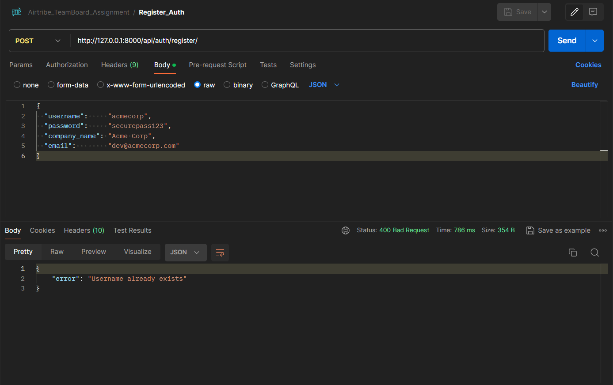
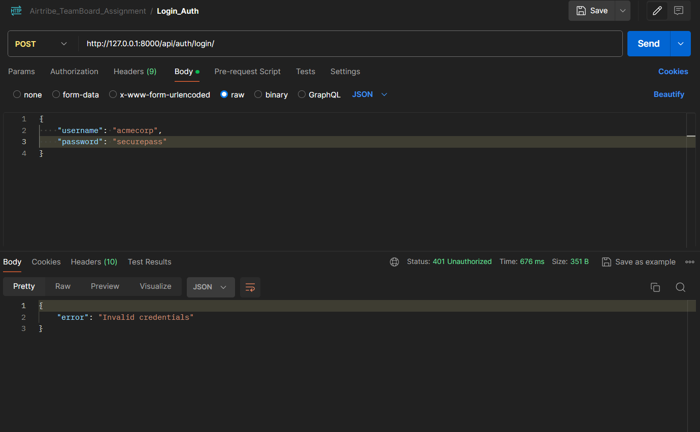

# TeamBoard 
An AI-powered Knowledge Base, a curated database of questions and answers covering common technical topics: APIs, databases, cloud infrastructure, backend frameworks, and more.

The product is sold as a B2B API service. Companies, your customers, integrate this API directly into their own products: internal helpdesks, developer portals, onboarding tools, or customer-facing chatbots. When one of their users types a question, their product calls your API, gets matching answers back, and displays them.

## Table Of Content

## Tests

### Test 1 — Register (Success)

- **Method:** `POST`
- **URL:** `http://127.0.0.1:8000/api/auth/register/`
- **Headers:** `Content-Type: application/json`
- **Body (raw JSON):**
```json
{
    "username": "acmecorp",
    "password": "securepass123",
    "company_name": "Acme Corp",
    "email": "dev@acmecorp.com"
}
```
- **Expected:** `201 Created`

<!-- Screenshot: -->


---

### Test 2 — Register Duplicate Username

- **Method:** `POST`
- **URL:** `http://127.0.0.1:8000/api/auth/register/`
- **Headers:** `Content-Type: application/json`
- **Body (raw JSON):**
```json
{
    "username": "acmecorp",
    "password": "anotherpass",
    "company_name": "Acme Again",
    "email": "another@acme.com"
}
```
- **Expected:** `400 Bad Request`

<!-- Screenshot: -->


---

### Test 3 — Login (Success)

- **Method:** `POST`
- **URL:** `http://127.0.0.1:8000/api/auth/login/`
- **Headers:** `Content-Type: application/json`
- **Body (raw JSON):**
```json
{
    "username": "acmecorp",
    "password": "securepass123"
}
```
- **Expected:** `200 OK`

<!-- Screenshot: -->


---

### Test 4 — Login Wrong Password

- **Method:** `POST`
- **URL:** `http://127.0.0.1:8000/api/auth/login/`
- **Headers:** `Content-Type: application/json`
- **Body (raw JSON):**
```json
{
    "username": "acmecorp",
    "password": "wrongpassword"
}
```
- **Expected:** `401 Unauthorized`

<!-- Screenshot: -->


---

### Test 5 — KB Query Without Token

- **Method:** `POST`
- **URL:** `http://127.0.0.1:8000/api/kb/query/`
- **Headers:** `Content-Type: application/json`
- **Body (raw JSON):**
```json
{
    "search": "django"
}
```
- **No Authorization header**
- **Expected:** `401 Unauthorized`

<!-- Screenshot: -->


---

### Test 6 — KB Query Missing Search Field

- **Method:** `POST`
- **URL:** `http://127.0.0.1:8000/api/kb/query/`
- **Headers:** `Content-Type: application/json`, `Authorization: Bearer <access_token>`
- **Body (raw JSON):**
```json
{}
```
- **Expected:** `400 Bad Request`

<!-- Screenshot: -->


---

### Test 7 — KB Query With Results

- **Method:** `POST`
- **URL:** `http://127.0.0.1:8000/api/kb/query/`
- **Headers:** `Content-Type: application/json`, `Authorization: Bearer <access_token>`
- **Body (raw JSON):**
```json
{
    "search": "django"
}
```
- **Expected:** `200 OK` with multiple results

<!-- Screenshot: -->


---

### Test 8 — KB Query With No Matches

- **Method:** `POST`
- **URL:** `http://127.0.0.1:8000/api/kb/query/`
- **Headers:** `Content-Type: application/json`, `Authorization: Bearer <access_token>`
- **Body (raw JSON):**
```json
{
    "search": "xyznothing"
}
```
- **Expected:** `200 OK` with `count: 0` and `results: []`

<!-- Screenshot: -->


---

### Test 9 — Usage Summary With CLIENT Token (Forbidden)

- **Method:** `GET`
- **URL:** `http://127.0.0.1:8000/api/admin/usage-summary/`
- **Headers:** `Authorization: Bearer <access_token>`
- **No body needed**
- **Expected:** `403 Forbidden`

<!-- Screenshot: -->


---

### Test 10 — Promote to Admin and Login

1. Open PGAdmin → `api_company` table → find the row for `acmecorp` → change `role` from `client` to `admin` → save.
2. Login again in Postman (repeat Test 3) to get a fresh access token.

- **Expected:** `200 OK` with new access token

<!-- Screenshot: -->


---


---

### Test 11 — Usage Summary With ADMIN Token

- **Method:** `GET`
- **URL:** `http://127.0.0.1:8000/api/admin/usage-summary/`
- **Headers:** `Authorization: Bearer <admin_access_token>`
- **No body needed**
- **Expected:** `200 OK` with `total_queries`, `active_companies`, and `top_search_terms`

<!-- Screenshot: -->


---