# TeamBoard

An AI-powered Knowledge Base, a curated database of questions and answers covering common technical topics: APIs, databases, cloud infrastructure, backend frameworks, and more.

The product is sold as a B2B API service. Companies integrate this API directly into their own products — internal helpdesks, developer portals, onboarding tools, or customer-facing chatbots. When one of their users types a question, their product calls the API, gets matching answers back, and displays them.

---

## Table of Contents

- [TeamBoard](#teamboard)
  - [Table of Contents](#table-of-contents)
  - [Tech Stack](#tech-stack)
  - [Project Structure](#project-structure)
  - [Setup](#setup)
    - [1. Clone the Repository](#1-clone-the-repository)
    - [2. Create Virtual Environment](#2-create-virtual-environment)
    - [3. Install Dependencies](#3-install-dependencies)
    - [4. Set Up PostgreSQL via Docker](#4-set-up-postgresql-via-docker)
    - [5. Configure Environment Variables](#5-configure-environment-variables)
    - [6. Apply Migrations](#6-apply-migrations)
    - [7. Seed the Knowledge Base](#7-seed-the-knowledge-base)
    - [8. Run the Server](#8-run-the-server)
  - [API Endpoints](#api-endpoints)
  - [Postman Collection](#postman-collection)
  - [Tests](#tests)
    - [Test 1 — Register (Success)](#test-1--register-success)
    - [Test 2 — Register Duplicate Username](#test-2--register-duplicate-username)
    - [Test 3 — Login (Success)](#test-3--login-success)
    - [Test 4 — Login Wrong Password](#test-4--login-wrong-password)
    - [Test 5 — KB Query Without Token](#test-5--kb-query-without-token)
    - [Test 6 — KB Query Missing Search Field](#test-6--kb-query-missing-search-field)
    - [Test 7 — KB Query With Results](#test-7--kb-query-with-results)
    - [Test 8 — KB Query With No Matches](#test-8--kb-query-with-no-matches)
    - [Test 9 — Usage Summary With CLIENT Token (Forbidden)](#test-9--usage-summary-with-client-token-forbidden)
    - [Test 10 — Promote to Admin and Login](#test-10--promote-to-admin-and-login)
    - [Test 11 — Usage Summary With ADMIN Token](#test-11--usage-summary-with-admin-token)

---

## Tech Stack

- Python 3.14
- Django 6.0
- Django REST Framework
- SimpleJWT (JWT Authentication)
- PostgreSQL (via Docker)
- Postman (API Testing)

---

## Project Structure

```
├── .env.local
├── .gitignore
├── README.md
├── requirements.txt
├── manage.py
├── teamboard/
│   ├── __init__.py
│   ├── asgi.py
│   ├── settings.py
│   ├── urls.py
│   └── wsgi.py
└── api/
    ├── __init__.py
    ├── apps.py
    ├── models.py
    ├── signals.py
    ├── serializers.py
    ├── views.py
    ├── permissions.py
    ├── urls.py
    └── management/
        └── commands/
            └── seed_kb.py
```

---

## Setup

### 1. Clone the Repository

```bash
git clone <your-repo-url>
cd TeamBoard
```

### 2. Create Virtual Environment

```bash
python -m venv venv
venv\Scripts\activate        # Windows
# source venv/bin/activate   # Mac/Linux
```

### 3. Install Dependencies

```bash
pip install -r requirements.txt
```

### 4. Set Up PostgreSQL via Docker

```bash
docker run -d --name teamboard-db -p 8080:5432 -e POSTGRES_DB=teamboard_db -e POSTGRES_USER=postgres -e POSTGRES_PASSWORD=your_password postgres
```

### 5. Configure Environment Variables

Create a `.env.local` file in the project root with the following:

```
DB_NAME=teamboard_db
DB_USER=postgres
DB_PASSWORD=your_password
DB_HOST=localhost
DB_PORT=8080
SECRET_KEY=your_django_secret_key
```

### 6. Apply Migrations

```bash
python manage.py makemigrations
python manage.py migrate
```

Verify tables in PGAdmin: `api_company`, `api_kbentry`, `api_querylog`, and Django's auth tables.

### 7. Seed the Knowledge Base

```bash
python manage.py seed_kb
```

This inserts 12 sample Q&A entries across 5 categories (API, Database, Cloud, Framework, General).

### 8. Run the Server

```bash
python manage.py runserver
```

Server runs at `http://127.0.0.1:8000/`.

---

## API Endpoints

| Method | Endpoint                    | Auth   | Description                              |
| ------ | --------------------------- | ------ | ---------------------------------------- |
| POST   | `/api/auth/register/`       | Public | Register a company and get JWT + API key |
| POST   | `/api/auth/login/`          | Public | Login and receive a fresh JWT            |
| POST   | `/api/kb/query/`            | JWT    | Search the knowledge base                |
| GET    | `/api/admin/usage-summary/` | Admin  | View platform-wide usage statistics      |

---

## Postman Collection

Import the included `TeamBoard.postman_collection.json` file into Postman to run all 11 test scenarios.

---

## Tests

### Test 1 — Register (Success)

- **Method:** `POST`
- **URL:** `http://127.0.0.1:8000/api/auth/register/`
- **Headers:** `Content-Type: application/json`
- **Body (raw JSON):**
```json
{
    "username": "acmecorp",
    "password": "securepass123",
    "company_name": "Acme Corp",
    "email": "dev@acmecorp.com"
}
```
- **Expected:** `201 Created`
 
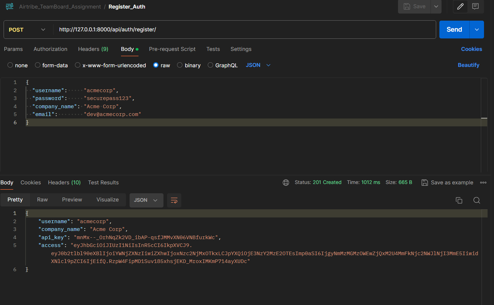

---

### Test 2 — Register Duplicate Username

- **Method:** `POST`
- **URL:** `http://127.0.0.1:8000/api/auth/register/`
- **Headers:** `Content-Type: application/json`
- **Body (raw JSON):**
```json
{
    "username": "acmecorp",
    "password": "anotherpass",
    "company_name": "Acme Again",
    "email": "another@acme.com"
}
```
- **Expected:** `400 Bad Request`

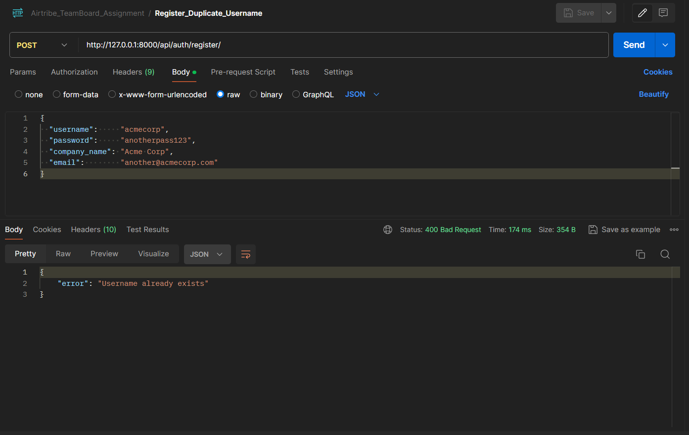

---

### Test 3 — Login (Success)

- **Method:** `POST`
- **URL:** `http://127.0.0.1:8000/api/auth/login/`
- **Headers:** `Content-Type: application/json`
- **Body (raw JSON):**
```json
{
    "username": "acmecorp",
    "password": "securepass123"
}
```
- **Expected:** `200 OK`

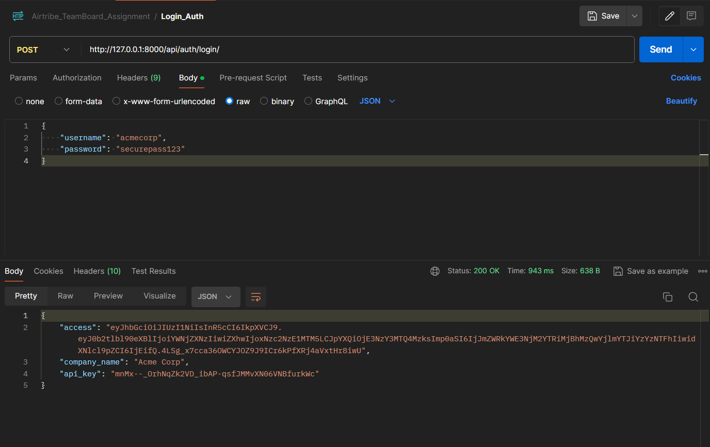

---

### Test 4 — Login Wrong Password

- **Method:** `POST`
- **URL:** `http://127.0.0.1:8000/api/auth/login/`
- **Headers:** `Content-Type: application/json`
- **Body (raw JSON):**
```json
{
    "username": "acmecorp",
    "password": "wrongpassword"
}
```
- **Expected:** `401 Unauthorized`

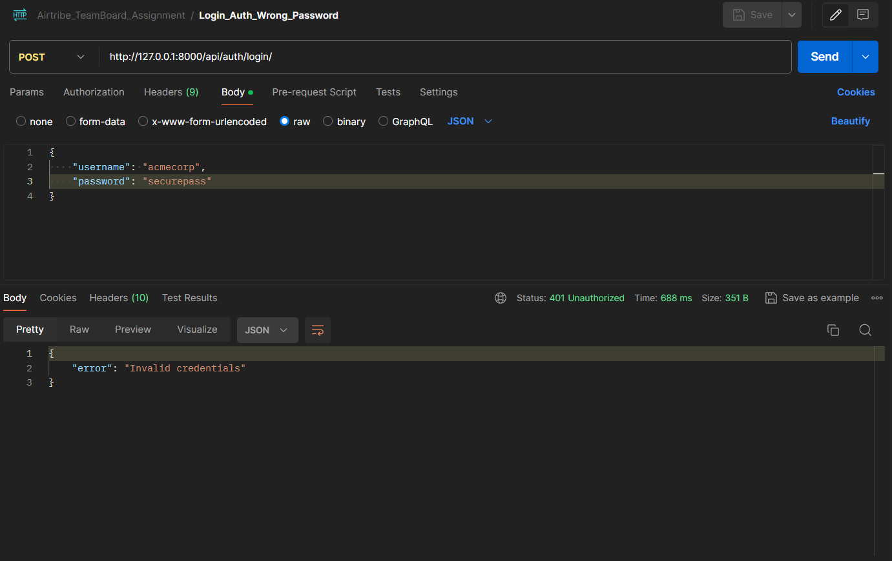

---

### Test 5 — KB Query Without Token

- **Method:** `POST`
- **URL:** `http://127.0.0.1:8000/api/kb/query/`
- **Headers:** `Content-Type: application/json`
- **Body (raw JSON):**
```json
{
    "search": "django"
}
```
- **No Authorization header**
- **Expected:** `401 Unauthorized`

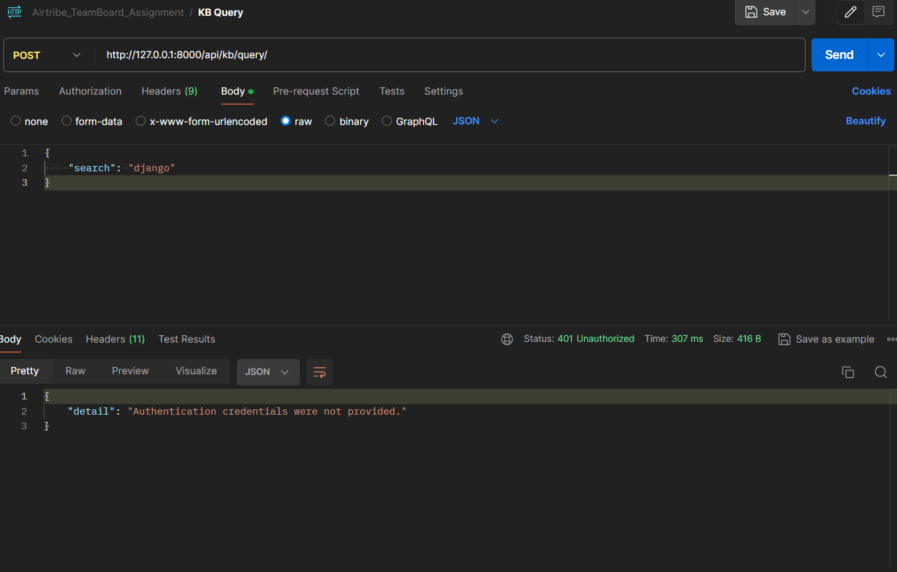

---

### Test 6 — KB Query Missing Search Field

- **Method:** `POST`
- **URL:** `http://127.0.0.1:8000/api/kb/query/`
- **Headers:** `Content-Type: application/json`, `Authorization: Bearer <access_token>`
- **Body (raw JSON):**
```json
{}
```
- **Expected:** `400 Bad Request`

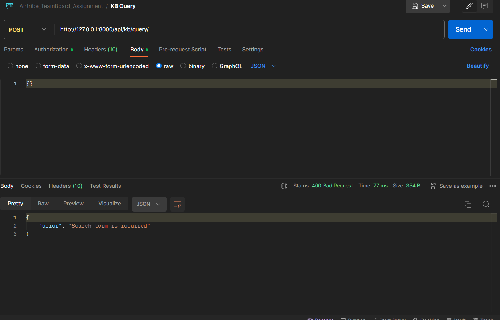

---

### Test 7 — KB Query With Results

- **Method:** `POST`
- **URL:** `http://127.0.0.1:8000/api/kb/query/`
- **Headers:** `Content-Type: application/json`, `Authorization: Bearer <access_token>`
- **Body (raw JSON):**
```json
{
    "search": "django"
}
```
- **Expected:** `200 OK` with multiple results

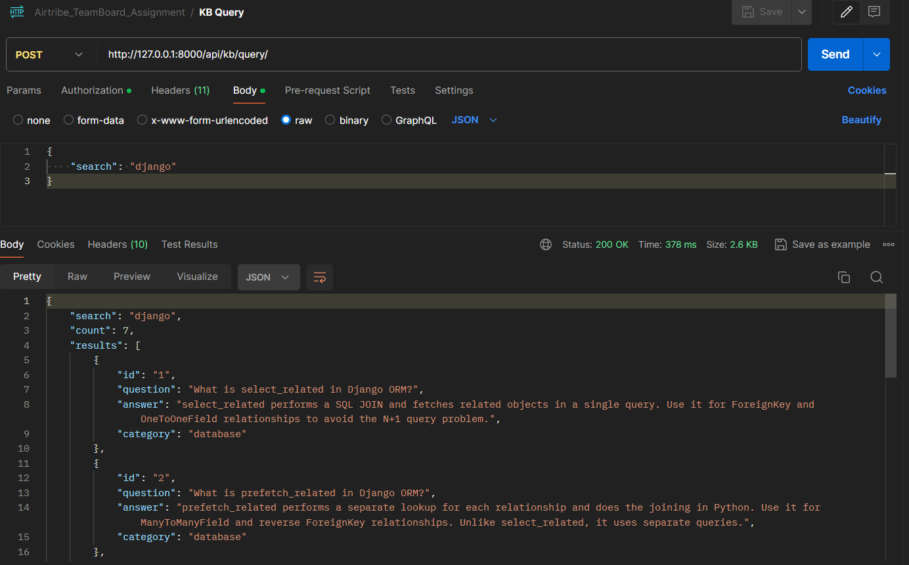

---

### Test 8 — KB Query With No Matches

- **Method:** `POST`
- **URL:** `http://127.0.0.1:8000/api/kb/query/`
- **Headers:** `Content-Type: application/json`, `Authorization: Bearer <access_token>`
- **Body (raw JSON):**
```json
{
    "search": "xyznothing"
}
```
- **Expected:** `200 OK` with `count: 0` and `results: []`

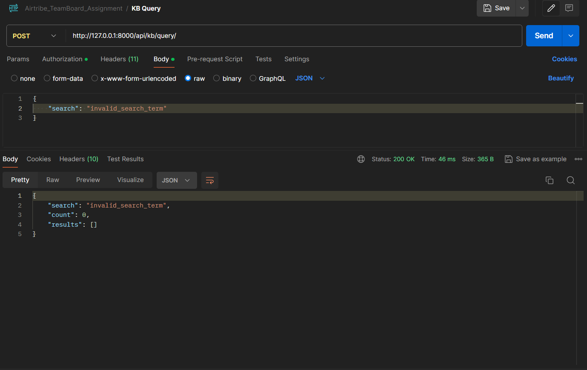

---

### Test 9 — Usage Summary With CLIENT Token (Forbidden)

- **Method:** `GET`
- **URL:** `http://127.0.0.1:8000/api/admin/usage-summary/`
- **Headers:** `Authorization: Bearer <access_token>`
- **No body needed**
- **Expected:** `403 Forbidden`

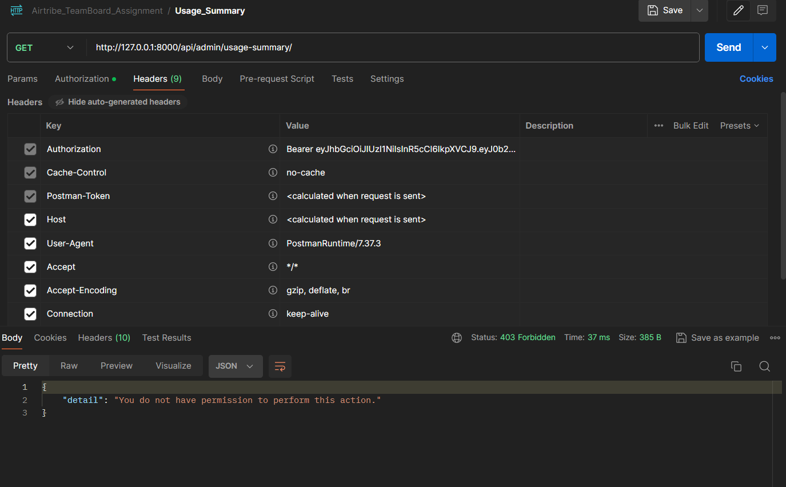

---

### Test 10 — Promote to Admin and Login

1. Open PGAdmin → `api_company` table → find the row for `acmecorp` → change `role` from `client` to `admin` → save.
2. Login again in Postman (repeat Test 3) to get a fresh access token.

- **Expected:** `200 OK` with new access token

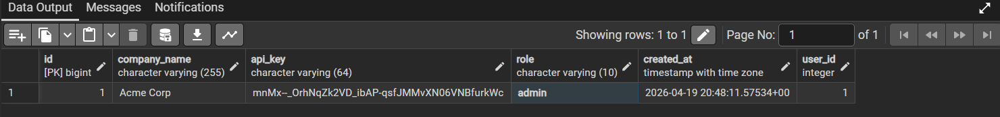

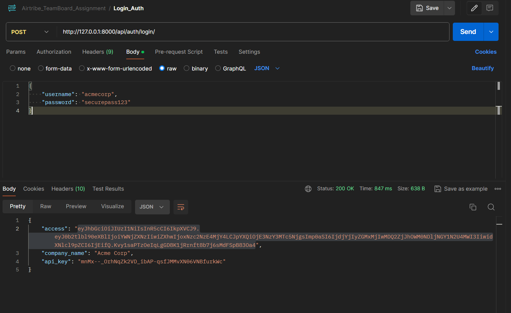

---

### Test 11 — Usage Summary With ADMIN Token

- **Method:** `GET`
- **URL:** `http://127.0.0.1:8000/api/admin/usage-summary/`
- **Headers:** `Authorization: Bearer <admin_access_token>`
- **No body needed**
- **Expected:** `200 OK` with `total_queries`, `active_companies`, and `top_search_terms`

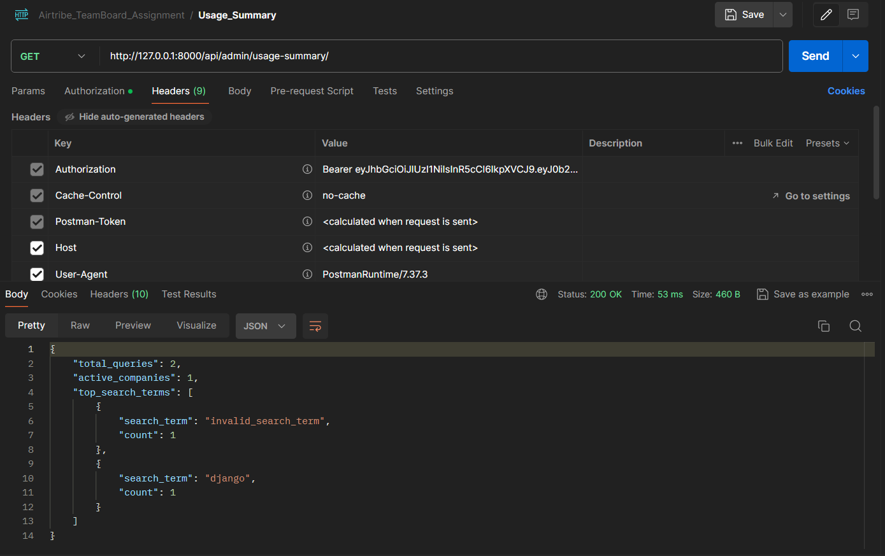